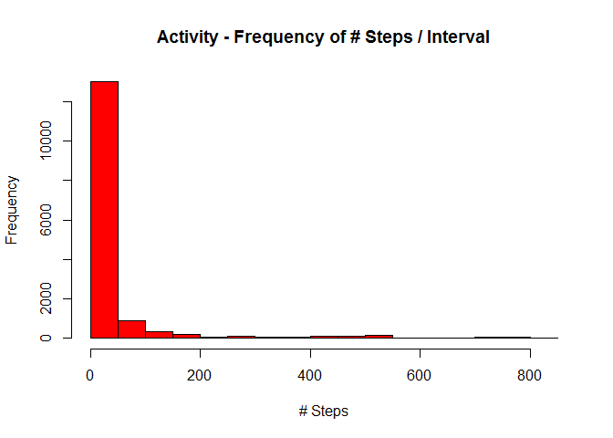

# Reproducible Research: Peer Assessment 1
WR  
November 11, 2015  

## Notes 

```r
# always use echo = TRUE for displaying code for this assignment 
# For... plotting...use any plotting system in R (i.e., base, lattice, ggplot2)
```

## Loading and preprocessing the data

```r
# Show any code that is needed to 
# 1.Load the data... 
# 2.Process/transform the data (if necessary) into a format suitable for your analysis 

# load libraries 
library(dplyr)
```

```
## 
## Attaching package: 'dplyr'
## 
## The following objects are masked from 'package:stats':
## 
##     filter, lag
## 
## The following objects are masked from 'package:base':
## 
##     intersect, setdiff, setequal, union
```

```r
# read in data from file 
activityLog.byInterval <- read.table(
    file = "activity.csv", header = TRUE, sep = ",", na.strings = "NA", 
    colClasses = c("numeric", "factor", "factor")
  )

# view some Exploratory Data Analysis items - By Interval 
summary(activityLog.byInterval)
```

```
##      steps                date          interval    
##  Min.   :  0.00   2012-10-01:  288   0      :   61  
##  1st Qu.:  0.00   2012-10-02:  288   10     :   61  
##  Median :  0.00   2012-10-03:  288   100    :   61  
##  Mean   : 37.38   2012-10-04:  288   1000   :   61  
##  3rd Qu.: 12.00   2012-10-05:  288   1005   :   61  
##  Max.   :806.00   2012-10-06:  288   1010   :   61  
##  NA's   :2304     (Other)   :15840   (Other):17202
```

```r
head(activityLog.byInterval)
```

```
##   steps       date interval
## 1    NA 2012-10-01        0
## 2    NA 2012-10-01        5
## 3    NA 2012-10-01       10
## 4    NA 2012-10-01       15
## 5    NA 2012-10-01       20
## 6    NA 2012-10-01       25
```

```r
# get mean and sd by interval (for comparison to the comparable "by day #s")
steps.mn.byInterval <- mean(activityLog.byInterval$steps, na.rm = TRUE)
steps.sd.byInterval <- sd(activityLog.byInterval$steps, na.rm = TRUE)
steps.md.byInterval <- median(activityLog.byInterval$steps, na.rm = TRUE)

# print results - by Interval 
steps.mn.byInterval 
```

```
## [1] 37.3826
```

```r
steps.sd.byInterval 
```

```
## [1] 111.9955
```

```r
steps.md.byInterval 
```

```
## [1] 0
```

```r
# group by day 
activityLog.byDay <- activityLog.byInterval %>% 
  group_by(date) %>% 
  summarize(SumSteps = sum(steps, na.rm = TRUE), MeanSteps = mean(steps, na.rm = TRUE))

# ref calc for later 
# steps.mn.byDay <- mean(activityLog.byDay$SumSteps, na.rm = TRUE)

# view some Exploratory Data Analysis items - By Day 
summary(activityLog.byDay)
```

```
##          date       SumSteps       MeanSteps      
##  2012-10-01: 1   Min.   :    0   Min.   : 0.1424  
##  2012-10-02: 1   1st Qu.: 6778   1st Qu.:30.6979  
##  2012-10-03: 1   Median :10395   Median :37.3785  
##  2012-10-04: 1   Mean   : 9354   Mean   :37.3826  
##  2012-10-05: 1   3rd Qu.:12811   3rd Qu.:46.1597  
##  2012-10-06: 1   Max.   :21194   Max.   :73.5903  
##  (Other)   :55                   NA's   :8
```

```r
head(activityLog.byDay)
```

```
## Source: local data frame [6 x 3]
## 
##         date SumSteps MeanSteps
##       (fctr)    (dbl)     (dbl)
## 1 2012-10-01        0       NaN
## 2 2012-10-02      126   0.43750
## 3 2012-10-03    11352  39.41667
## 4 2012-10-04    12116  42.06944
## 5 2012-10-05    13294  46.15972
## 6 2012-10-06    15420  53.54167
```

```r
# get mean and sd by day 
steps.mn.byDay <- mean(activityLog.byDay$SumSteps, na.rm = TRUE)
steps.sd.byDay <- sd(activityLog.byDay$SumSteps, na.rm = TRUE)
steps.md.byDay <- median(activityLog.byDay$SumSteps, na.rm = TRUE)

# print results - by day 
steps.mn.byDay 
```

```
## [1] 9354.23
```

```r
steps.sd.byDay 
```

```
## [1] 5405.895
```

```r
steps.md.byDay 
```

```
## [1] 10395
```

```r
# get total steps 
steps.count.intervals <- length(activityLog.byInterval$steps)
steps.count.days <- length(activityLog.byDay$date)
steps.count.total <- sum(activityLog.byDay$SumSteps)

# print results - overall 
steps.count.intervals 
```

```
## [1] 17568
```

```r
steps.count.days 
```

```
## [1] 61
```

```r
steps.count.total
```

```
## [1] 570608
```

```r
# group by TimePeriod
activityLog.byTimePeriod <- activityLog.byInterval %>% 
  group_by(interval) %>% 
  summarize(SumSteps = sum(steps, na.rm = TRUE), MeanSteps = mean(steps, na.rm = TRUE))

# get max activity by Time Period 
steps.max.ByTimePeriod.count <- max(activityLog.byTimePeriod$SumSteps, na.rm = TRUE)
steps.max.ByTimePeriod.mn <- max(activityLog.byTimePeriod$MeanSteps, na.rm = TRUE)
steps.max.ByTimePeriod.interval <- activityLog.byTimePeriod %>% 
  select(interval, SumSteps, MeanSteps) %>%
  filter(SumSteps == max(activityLog.byTimePeriod$SumSteps, na.rm = TRUE))

# print results 
steps.max.ByTimePeriod.interval
```

```
## Source: local data frame [1 x 3]
## 
##   interval SumSteps MeanSteps
##     (fctr)    (dbl)     (dbl)
## 1      835    10927  206.1698
```

```r
steps.max.ByTimePeriod.count
```

```
## [1] 10927
```

```r
steps.max.ByTimePeriod.interval
```

```
## Source: local data frame [1 x 3]
## 
##   interval SumSteps MeanSteps
##     (fctr)    (dbl)     (dbl)
## 1      835    10927  206.1698
```


## What is mean total number of steps taken per day?

In this section, I put the R code first and then the textul descriptions at the bottom of the section.  


```r
# For this part of the assignment, you can ignore the missing values in the dataset.
# 1.Calculate the total number of steps taken per day
# 2. ... Make a histogram of the total number of steps taken each day
# 3. Calculate and report the mean and median of the total number of steps taken per day

# display histogram of data - by interval (for comparison to the "by day #s")
hist(
     activityLog.byInterval$steps, col = "red", 
     main = "Activity - Frequency of # Steps / Interval",
     xlab = "# Steps",
     ylab = "Frequency"
 )
```

 

```r
# display histogram of data - by day 
hist(
     activityLog.byDay$SumSteps, col = "red", 
     main = "Activity - Frequency of # Steps / Day",
     xlab = "# Steps",
     ylab = "Frequency"
 )
```

 

From the above, I graphed a histogram of Frequency of # steps, both per day (per the question) and per interval (for comparison purposes).  The "per interval" plot appears to be the shape of a Poisson Distribution, while the "per day" plot appears to be converging in the shape of a Normal Distribution.  Since this is "individual specific", the results most likely cannot be generalized.  If these were averages from a population, then we could generalize the results.  

Specifically, per the question, the mean steps per day is 9354.2295082 and the medium steps per day is 1.0395\times 10^{4} 

The total # of steps / day is 

0, 126, 1.1352\times 10^{4}, 1.2116\times 10^{4}, 1.3294\times 10^{4}, 1.542\times 10^{4}, 1.1015\times 10^{4}, 0, 1.2811\times 10^{4}, 9900, 1.0304\times 10^{4}, 1.7382\times 10^{4}, 1.2426\times 10^{4}, 1.5098\times 10^{4}, 1.0139\times 10^{4}, 1.5084\times 10^{4}, 1.3452\times 10^{4}, 1.0056\times 10^{4}, 1.1829\times 10^{4}, 1.0395\times 10^{4}, 8821, 1.346\times 10^{4}, 8918, 8355, 2492, 6778, 1.0119\times 10^{4}, 1.1458\times 10^{4}, 5018, 9819, 1.5414\times 10^{4}, 0, 1.06\times 10^{4}, 1.0571\times 10^{4}, 0, 1.0439\times 10^{4}, 8334, 1.2883\times 10^{4}, 3219, 0, 0, 1.2608\times 10^{4}, 1.0765\times 10^{4}, 7336, 0, 41, 5441, 1.4339\times 10^{4}, 1.511\times 10^{4}, 8841, 4472, 1.2787\times 10^{4}, 2.0427\times 10^{4}, 2.1194\times 10^{4}, 1.4478\times 10^{4}, 1.1834\times 10^{4}, 1.1162\times 10^{4}, 1.3646\times 10^{4}, 1.0183\times 10^{4}, 7047, 0

While this is an interestig list, the total # of steps taken per day is probably be best described by the histogram of the corresponding data (redisplayed here for completeness)

```r
# display histogram of data - by day 
hist(
     activityLog.byDay$SumSteps, col = "red", 
     main = "Activity - Frequency of # Steps / Day",
     xlab = "# Steps",
     ylab = "Frequency"
 )
```

 

Lastly, the overall total # of intervals is 17568, while the total # of days is 61.  The total step count overall is 5.70608\times 10^{5}, mean steps by interval is 37.3825996, and mean steps by day is 9354.2295082.  


## What is the average daily activity pattern?

Here, I looked at the total (sum) # steps taken by interval, and overlayed each day on top of each other to see patterns in the data.  Here, it looks like there are intervals with higher activity (most likely "awake" hours) and periods of lower acivity (probably related to "asleep" hours).  

Next, I looked at the total (sum) and average (mean) # steps taken by day, to again see a different perspective of patterns in the data.  Here, it looks like some days have higher activity than others.  Also note, the only difference in doing the total (sum) instead of the average (mean) is the magnitude of the y-axis, which is to be expected, and the pattern of the data stays the same.  

Next, I plotted the total (sum) and average (mean) steps taken by interval across days (per the question).  Here, it looks like some intervals have higher activity than others.  The pattern is present when plotting the raw, individual interval data as the first plot showed, but in doing sums or averages, it allows the pattern in the data to become "clearer".  Also note, the only difference in doing the total (sum) instead of the average (mean) is the magnitude of the y-axis, which is to be expected, and the pattern of the data stays the same.  

The 5-minute interval with the most activity is most likely during an actual "workout", say a run or a walk.  Visually from the graphs it is towards the right of the graph where the peak occurs.  The maximum total (sum) activity across days in any given interval is 1.0927\times 10^{4}, while the maximum average (mean) activity in any given interval is 206.1698113 and the interval where this occurs is 835.

The work for this section is below.  


```r
#1.Make a time series plot (i.e. type = "l") of the 5-minute interval (x-axis) and the #average number of steps taken, averaged across all days (y-axis)

#2.Which 5-minute interval, on average across all the days in the dataset, contains the #maximum number of steps?

# creating 2 x 1 display - want to compare the By Day and the By Interval 
#par(mfcol = c(2,1))
# , mar = c(4,4,2,1)

# plot1 - here placed Row 1, Column 1 
plot(
  x = activityLog.byInterval$interval, 
  y = activityLog.byInterval$steps, 
  type = "l",
  main = "Total (Sum) Steps vs. Interval", 
  xlab = "Interval", 
  ylab = "Total (Sum) Steps"
)
```

 

```r
# plot2 - here placed Row 1, Column 2 
plot(
  x = activityLog.byDay$date, 
  y = activityLog.byDay$SumSteps, 
  type = "l",
  main = "Total (Sum) Steps vs. Day", 
  xlab = "Day", 
  ylab = "Total (Sum) Steps"
)
```

 

```r
# plot3 - here placed Row 1, Column 2 
plot(
  x = activityLog.byDay$date, 
  y = activityLog.byDay$MeanSteps, 
  type = "l",
  main = "Average (Mean) Steps vs. Day", 
  xlab = "Day", 
  ylab = "Average (Mean) Steps"
)
```

 

```r
# plot4 - here placed Row 1, Column 2 
plot(
  x = activityLog.byTimePeriod$interval, 
  y = activityLog.byTimePeriod$SumSteps, 
  type = "l",
  main = "Total (Sum) Steps vs. Time Period of Day", 
  xlab = "Time Period of Day", 
  ylab = "Total (Sum) Steps"
)
```

 

```r
# plot4 - here placed Row 1, Column 2 
plot(
  x = activityLog.byTimePeriod$interval, 
  y = activityLog.byTimePeriod$MeanSteps, 
  type = "l",
  main = "Average (Mean) Steps vs. Time Period of Day", 
  xlab = "Time Period of Day", 
  ylab = "Average (Mean) Steps"
)
```

 


## Imputing missing values

Again, textual writeup after the below R code.  


```r
# ... number of days/intervals where there are missing values (coded as NA) 
# ... may introduce bias into some calculations or summaries of the data.

# 1.Calculate and report the total number of missing values [rows] in the dataset 

# 2.Devise a strategy for filling in all of the missing values in the dataset. 
# ... use the mean/median for that day, or the mean for that 5-minute interval, etc.


# 3.Create a new dataset ... [ == ]... the original dataset ... missing data filled in. 


# 4.Make a histogram of the total number of steps taken each day 
# Calculate and report the mean and median total number of steps taken per day. 
# Do these values differ from the estimates from the first part of the assignment? 
# What is the impact of imputing missing data on the estimates... total daily ...[#] steps?

# filter for NAs and get subset 
activityLog.byInterval.YesNas <- activityLog.byInterval %>% 
  select(steps, date, interval) %>% 
  filter(is.na(steps)) 
  
# filter for NoNas and get subset 
activityLog.byInterval.NoNas <- activityLog.byInterval %>% 
  select(steps, date, interval) %>% 
  filter(!is.na(steps)) 

# get some computations to answer reuested information by the question 
steps.count.NoNas <- length(activityLog.byInterval.NoNas$interval)
steps.count.YesNas <- length(activityLog.byInterval.YesNas$interval)
steps.count.total <- length(activityLog.byInterval$interval)

# print output 
steps.count.NoNas 
```

```
## [1] 15264
```

```r
steps.count.YesNas 
```

```
## [1] 2304
```

```r
steps.count.total 
```

```
## [1] 17568
```

```r
# group by TimePeriod
activityLog.byTimePeriod.NoNas <- activityLog.byInterval.NoNas %>% 
  group_by(interval) %>% 
  summarize(SumSteps = sum(steps, na.rm = TRUE), MeanSteps = mean(steps, na.rm = TRUE))

# replace steps == NA with the average (mean) steps for that time period across days 
activityLog.byInterval.YesNas$steps <- activityLog.byTimePeriod.NoNas$MeanSteps

# recreate dataset 
activityLog.byIntvB <- rbind(activityLog.byInterval.NoNas, activityLog.byInterval.YesNas)

# group by day 
activityLog.byDayB <- activityLog.byIntvB %>% 
  group_by(date) %>% 
  summarize(SumSteps = sum(steps, na.rm = TRUE), MeanSteps = mean(steps, na.rm = TRUE))

# get mean and sd by day 
steps.mnB.byDay <- mean(activityLog.byDayB$SumSteps, na.rm = TRUE)
steps.sdB.byDay <- sd(activityLog.byDayB$SumSteps, na.rm = TRUE)
steps.mdB.byDay <- median(activityLog.byDayB$SumSteps, na.rm = TRUE)

# print results - with NAs replaced with averages (means) of intervals across days 
steps.mnB.byDay 
```

```
## [1] 10766.19
```

```r
steps.sdB.byDay 
```

```
## [1] 3974.391
```

```r
steps.mdB.byDay 
```

```
## [1] 10766.19
```

```r
# print results - original data 
steps.mn.byDay 
```

```
## [1] 9354.23
```

```r
steps.sd.byDay 
```

```
## [1] 5405.895
```

```r
steps.md.byDay 
```

```
## [1] 10395
```

```r
# display histogram of data - by day 
hist(
     activityLog.byDayB$SumSteps, col = "red", 
     main = "Activity - Frequency of # Steps / Day - After to Adjustment per question",
     xlab = "# Steps",
     ylab = "Frequency"
 )
```

 

Per the question, the number of missing values is 2304, the number of intervals with data is 15264, and the total number of intervals is 17568.  

To correct for NAs, I first subsetted the dataset (horizontally filtering the data) into rows with NAs and rows without NAs.  For the rows without NAs, I computed the average (mean) for each interval across all days to get an estimate of the value that we could approximate each NA with.  I then replaced the NAs with their corresponding interval means across the days.  I then used "rbind"" to combine the two subsets of data back together, which is equivalent to the original except for NAs being replaced with average (mean) values for that interval across days.  

Per the question, prior to the adjustment for NAs, by replacing NAs with the the average (mean) steps for an interval across days, the following are some summary statistics for the dataset:  mean = 9354.2295082, sd = 5405.8950952, and median = 1.0395\times 10^{4}.  After the adjustment for NAs, the following are some summary statistics for the new, adjusted dataset:  mean = 1.0766189\times 10^{4}, sd = 3974.390746, and median = 1.0766189\times 10^{4}.  Hence, with the adjustment, the mean and median increase and the sd decreases.  

Lastly, to compare visually how the distribution of steps changes, let's look at the histogram of steps per day prior to the adjustment for NAs and after the adjustment for NAs. 


```r
# display histogram of data - by day - prior to adjustment 
hist(
     activityLog.byDay$SumSteps, col = "red", 
     main = "Activity - Frequency of # Steps / Day - Prior to Adjustment per question",
     xlab = "# Steps",
     ylab = "Frequency"
 )
```

 

```r
# display histogram of data - by day - after adjustment 
hist(
     activityLog.byDayB$SumSteps, col = "red", 
     main = "Activity - Frequency of # Steps / Day - After Adjustment per question",
     xlab = "# Steps",
     ylab = "Frequency"
 )
```

 

From the two histograms, and confirmed by the mean, sd, and median calculations done just prior, with the adjustment, more observtions are removed from the lowest bin on the graph and replaced with observations in the middle bin on the graph (i.e. replacing NAs with the mean values).  From the mean, sd, and median (#s above), with the adjustment for NAs, the mean goes up, the mediam goes up, and the sd goes down - all of which make sense from a background understanding in the underlying statistics.  

## Are there differences in activity patterns between weekdays and weekends?

The textual writeup for this is after the R Code.


```r
# did calculations by day 
activityLog.byDayC <- cbind(activityLog.byDayB, DayOfWeek = weekdays(as.Date(activityLog.byDayB$date))) 

# the following function correctly determines whether Weekday or weekend       
#if (weekdays(as.Date(activityLog.byDayC$date)) %in% c("Monday", "Tuesday", "Wednesday", #"Thursday", "Friday")) { "Weekday"} else {"Weekend"}

# filter for Weekday and get subset 
activityLog.byDay.Weekday <- activityLog.byDayC %>% 
  select(date, SumSteps, MeanSteps, DayOfWeek) %>% 
  filter(DayOfWeek %in% c("Monday", "Tuesday", "Wednesday", "Thursday", "Friday")) 
  
# filter for Weekend and get subset 
activityLog.byDay.Weekend <- activityLog.byDayC %>% 
  select(date, SumSteps, MeanSteps, DayOfWeek) %>% 
  filter(!(DayOfWeek %in% c("Monday", "Tuesday", "Wednesday", "Thursday", "Friday"))) 


# add WeekdayOrWeekend to the respective datasets  
activityLog.byDay.Weekday <- cbind(activityLog.byDay.Weekday, WeekdayOrWeekend = "Weekday")
activityLog.byDay.Weekend <- cbind(activityLog.byDay.Weekend, WeekdayOrWeekend = "Weekend")

# recreate dataset 
activityLog.byDay.All <- rbind(activityLog.byDay.Weekday, activityLog.byDay.Weekend)


# add weekday vs weekend column 
activityLog.byIntvC <- cbind(activityLog.byIntvB, DayOfWeek = weekdays(as.Date(activityLog.byIntvB$date))) 

# filter for Weekday and get subset 
activityLog.byIntvC.Weekday <- activityLog.byIntvC %>% 
  select(date, interval, steps, DayOfWeek) %>% 
  filter(DayOfWeek %in% c("Monday", "Tuesday", "Wednesday", "Thursday", "Friday")) 
  
# filter for Weekend and get subset 
activityLog.byIntvC.Weekend <- activityLog.byIntvC %>% 
  select(date, interval, steps, DayOfWeek) %>% 
  filter(!(DayOfWeek %in% c("Monday", "Tuesday", "Wednesday", "Thursday", "Friday"))) 

# add WeekdayOrWeekend to the respective datasets  
activityLog.byIntvC.Weekday <- cbind(activityLog.byIntvC.Weekday, WeekdayOrWeekend = "Weekday")
activityLog.byIntvC.Weekend <- cbind(activityLog.byIntvC.Weekend, WeekdayOrWeekend = "Weekend")

# group by TimePeriod
activityLog.byIntvCSum.Weekend <- activityLog.byIntvC.Weekend %>% 
  group_by(interval) %>% 
  summarize(SumSteps = sum(steps, na.rm = TRUE), MeanSteps = mean(steps, na.rm = TRUE))


# group by TimePeriod
activityLog.byIntvCSum.Weekday <- activityLog.byIntvC.Weekday %>% 
  group_by(interval) %>% 
  summarize(SumSteps = sum(steps, na.rm = TRUE), MeanSteps = mean(steps, na.rm = TRUE))
```

To segrgate Weekdays and Weekends, I first added a DayOfWeek variable (using cbind) to the dataset using the weekday function on the date variable (after converting to Date).  Next, I subset the datasets by weekdays and weekend days.  I then added a variable (using cbind) to each subset for "Weekday" or "Weekend" in a new variable called WeekdayOrWeekend.  I then combined th two subsets back together using rbind.  

I did the analysis both "per day" (for comparison) and "per interval across days" (per the question).  First, looking at "per day", we get the following.  


```r
# plot4 - here placed Row 1, Column 2 
plot(
  x = activityLog.byDay.Weekend$date, 
  y = activityLog.byDay.Weekend$MeanSteps, 
  type = "l",
  main = "Average (Mean) Steps vs. Day - Weekend", 
  xlab = "Day", 
  ylab = "Average (Mean) Steps"
)
```

 

```r
# plot4 - here placed Row 1, Column 2 
plot(
  x = activityLog.byDay.Weekday$date, 
  y = activityLog.byDay.Weekday$MeanSteps, 
  type = "l",
  main = "Average (Mean) Steps vs. Day - Weekday", 
  xlab = "Day", 
  ylab = "Average (Mean) Steps"
)
```

 

From the "per day"" data above, it appears that the activity was possibly higher mid-day for weekdays (probably walking around at work / school), but no other pattern is readily apparent.  

Next (per the question), looking at the "per interval across days", we see the following.  


```r
par(mfrow = c(2,1))

# plot4 - here placed Row 1, Column 2 
plot(
  x = activityLog.byIntvCSum.Weekend$interval, 
  y = activityLog.byIntvCSum.Weekend$MeanSteps, 
  type = "l",
  main = "Average (Mean) Steps vs. Time Period of Day - Weekend", 
  xlab = "Time Period of Day", 
  ylab = "Average (Mean) Steps"
)


# plot4 - here placed Row 1, Column 2 
plot(
  x = activityLog.byIntvCSum.Weekday$interval, 
  y = activityLog.byIntvCSum.Weekday$MeanSteps, 
  type = "l",
  main = "Average (Mean) Steps vs. Time Period of Day - Weekday", 
  xlab = "Time Period of Day", 
  ylab = "Average (Mean) Steps"
)
```

 

From these plots, it appears as if there is more activity on the weekends vs the weekdays, especially during the earlier intervals.  


